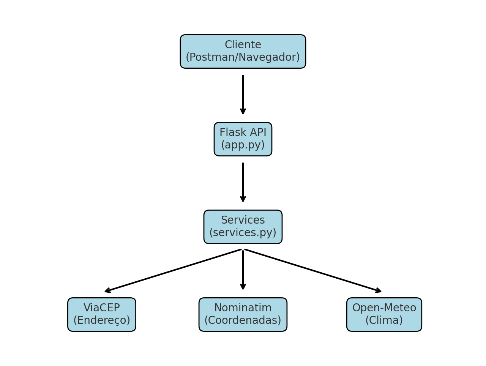

# GeoClima API

## Objetivo do Projeto
O objetivo da GeoClima API é integrar múltiplos serviços externos para fornecer, a partir de um CEP informado pelo usuário:
o endereço correspondente, as coordenadas geográficas (latitude e longitude), e a temperatura atual da localidade.
Essa API simplifica o acesso a múltiplas fontes de informação (ViaCEP, OpenStreetMap/Nominatim e Open-Meteo), reunsindo tudo em um só ponto de consulta.

## Tecnologias Utilizadas
- **Linguagem:** Python 3.x  
- **Framework:** Flask  
- **Bibliotecas:** Requests, Unittest  
- **APIs externas integradas:**
  - [ViaCEP](https://viacep.com.br/) → consulta de endereços por CEP  
  - [OpenStreetMap Nominatim](https://nominatim.openstreetmap.org/) → conversão de endereço em coordenadas geográficas  
  - [Open-Meteo](https://open-meteo.com/) → obtenção da temperatura atual  

## Arquitetura da API

A API segue a seguinte arquitetura de pastas:
```text
GEOCLIMAAPI
┣ docs/
┃ ┗ architecture.md
┣ postman/
┃ ┗ GeoClima.postman_collection.json
┣ src/
┃ ┣ app.py
┃ ┗ services.py
┣ tests/
┃ ┣ init.py
┃ ┗ test_app.py
┣ .gitignore
```
## Diagrama de Arquitetura

O diagrama abaixo ilustra os principais componentes da API e sua interação com os serviços externos:



### Fluxo de funcionamento
1. O usuário deve informar um CEP.  
2. A API consulta o ViaCEP e retorna o endereço.  
3. O endereço é enviado ao Nominatim (OpenStreetMap) para obter **latitude e longitude**.  
4. As coordenadas são utilizadas no Open-Meteo para obter a temperatura atual.  

---

## Instalação de Dependências

Antes de executar o projeto, instale as dependências:

```bash
pip install flask requests
```
Essas bibliotecas são responsáveis por:
Flask: criação dos endpoints da API
Requests: consumo das APIs externas (ViaCEP, OpenStreetMap, Open-Meteo)
Unittest: já incluso no Python, utilizado para testes automatizados

Como Executar o Projeto
1. Clonar o repositório
```bash
git clone https://github.com/sabrinassantoss/GeoClima.git
```
```bash
cd geoclima
```
2. Executar a API
```bash
cd src
python app.py
```
3. Acessar a API

Por padrão, a API rodará em:
```http
http://127.0.0.1:5000
```
Observação sobre a porta:
O Flask utiliza a porta 5000 por padrão.
Se a porta já estiver em uso no seu computador, será necessário alterar manualmente a porta no arquivo app.py, por exemplo:
```python
app.run(port=5001)
```
Nesse caso, a API estaria disponível em:
```cpp
http://127.0.0.1:5001
```
Em ambientes de hospedagem (ex: Render, Heroku, AWS), o endereço e a porta podem variar conforme a configuração do servidor.

## Endpoints da API
1. Consultar Endereço por CEP

Rota:

```http
GET /endereco/<cep>
```
Exemplo de requisição:
```http
/endereco/60811-905
```
Resposta:
```json
{
    "bairro": "Edson Queiroz",
    "cep": "60811-905",
    "complemento": "1321",
    "ddd": "85",
    "estado": "Ceará",
    "gia": "",
    "ibge": "2304400",
    "localidade": "Fortaleza",
    "logradouro": "Avenida Washington Soares",
    "regiao": "Nordeste",
    "siafi": "1389",
    "uf": "CE",
    "unidade": "Fundação Edson Queiroz Universidade de Fortaleza - UNIFOR"
}
```
2. Consultar Coordenadas por CEP

Rota:

```http
GET /coordenadas/<cep>
```
Exemplo de requisição:

```http
/coordenadas/60811-905
```
Resposta:

```json
{
    "latitude": -3.7578681,
    "longitude": -38.4878028
}
```
3. Consultar temperatura por CEP

Rota:

```http
GET /temperatura/<cep>
```
Exemplo de requisição:
```http
/temperatura/60811-905
```
Resposta:
```json
{
    "bairro": "Edson Queiroz",
    "cep": "60811-905",
    "cidade": "Fortaleza",
    "complemento": "1321",
    "endereco": "Avenida Washington Soares",
    "estado": "CE",
    "latitude": -3.7578681,
    "longitude": -38.4878028,
    "regiao": "Nordeste",
    "temperatura": 29.5
}
```
## Testes Automatizados
Os testes unitários foram implementados em tests/test_app.py utilizando unittest.

Para executar os testes:
```bash
python -m unittest discover -s tests
```
Exemplo de saída esperada:
```bash
...
----------------------------------------------------------------------
Ran 3 tests in 2.543s

OK
```
## Postman
O repositório contém uma coleção do Postman em:
```bash
postman/GeoClima.postman_collection.json
```
### Como usar:
1. Abra o Postman.  
2. Clique em **Import** → selecione o arquivo `GeoClima.postman_collection.json`.  
3. A coleção será adicionada com todas as requisições configuradas.  
4. Configure uma variável de ambiente chamada **`base_url`**:  
   - Valor: `http://127.0.0.1:5000`  
   - Assim, você poderá usar requisições como:  
     ```
     {{base_url}}/endereco/60534170
     ```
   em vez de escrever a URL completa toda vez.  

Isso facilita a execução e validação dos endpoints sem precisar rodar comandos manualmente.
