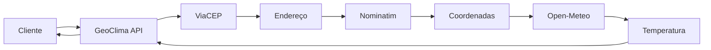

# GeoClima API 🌡️🗺️

[](https://www.python.org/)
[](https://flask.palletsprojects.com/)
[](LICENSE)

## Índice

- [Sobre o Projeto](#sobre-o-projeto)
- [Funcionalidades](#funcionalidades)
- [Tecnologias Utilizadas](#tecnologias-utilizadas)
- [Arquitetura](#arquitetura)
- [Pré-requisitos](#pré-requisitos)
- [Instalação](#instalação)
- [Como Executar](#como-executar)
- [Endpoints da API](#endpoints-da-api)
- [Testes](#testes)
- [Documentação Postman](#documentacao-postman)
- [Equipe de Desenvolvimento](#equipe-de-desenvolvimento)
- [Contribuindo](#contribuindo)
- [Licença](#licenca)


## Sobre o Projeto

A **GeoClima API** é uma aplicação RESTful que integra múltiplos serviços externos para fornecer informações completas sobre localização e clima a partir de um CEP brasileiro. Com apenas uma consulta, você obtém endereço completo, coordenadas geográficas e temperatura atual da localidade.

### Objetivo

Simplificar o acesso a múltiplas fontes de informação (ViaCEP, OpenStreetMap/Nominatim e Open-Meteo), reunindo tudo em um único ponto de consulta, facilitando o desenvolvimento de aplicações que necessitem dessas informações integradas.

## Funcionalidades

- ✅ Consulta de endereço completo por CEP
- ✅ Obtenção de coordenadas geográficas (latitude/longitude)
- ✅ Consulta de temperatura atual da localidade
- ✅ Integração com múltiplas APIs externas
- ✅ Tratamento de erros robusto
- ✅ Respostas em formato JSON

## Tecnologias Utilizadas

### Core
- **Linguagem:** Python 3.x
- **Framework:** Flask 3.0.0
- **Cliente HTTP:** Requests 2.31.0

### APIs Externas Integradas
| Serviço | Descrição | Documentação |
|---------|-----------|--------------|
| [ViaCEP](https://viacep.com.br/) | Consulta de endereços por CEP | [Docs](https://viacep.com.br/) |
| [OpenStreetMap Nominatim](https://nominatim.openstreetmap.org/) | Conversão de endereço em coordenadas | [Docs](https://nominatim.org/release-docs/latest/) |
| [Open-Meteo](https://open-meteo.com/) | Dados meteorológicos em tempo real | [Docs](https://open-meteo.com/en/docs) |

### Testes e Documentação
- **Framework de Testes:** Unittest (nativo do Python)
- **Documentação de API:** Postman Collection

## Arquitetura

### Estrutura de Diretórios

```
GeoClimaAPI/
│
├── docs/                       # Documentação do projeto
│   ├── architecture.md         # Detalhes da arquitetura
│   └── GeoClima_Arquitetura.png # Diagrama visual
│
├── postman/                    # Coleções para testes
│   └── GeoClima.postman_collection.json
│
├── src/                        # Código fonte
│   ├── app.py                  # Aplicação Flask e rotas
│   └── services.py             # Serviços de integração
│
├── tests/                      # Testes automatizados
│   ├── __init__.py
│   └── test_app.py             # Testes unitários
│
├── .gitignore                  # Arquivos ignorados pelo Git
├── README.md                   # Este arquivo
└── requirements.txt            # Dependências do projeto
```

### Diagrama de Arquitetura


### Fluxo de Funcionamento



1. **Entrada:** Cliente informa um CEP válido
2. **Consulta de Endereço:** API consulta o ViaCEP e obtém o endereço completo
3. **Geocodificação:** Endereço é enviado ao Nominatim para obter latitude e longitude
4. **Dados Climáticos:** Coordenadas são utilizadas no Open-Meteo para obter temperatura atual
5. **Resposta:** Dados consolidados são retornados ao cliente em formato JSON

## Pré-requisitos

Antes de começar, verifique se você atende aos seguintes requisitos:

- Python 3.8 ou superior instalado
- pip (gerenciador de pacotes do Python)
- Git para clonar o repositório
- Conexão com a internet (para acessar APIs externas)

## Instalação

### 1. Clone o repositório

```bash
git clone https://github.com/sabrinassantoss/GeoClima.git
cd GeoClima
```

### 2. Crie um ambiente virtual (recomendado)

```bash
# Windows
python -m venv venv
venv\Scripts\activate

# Linux/Mac
python3 -m venv venv
source venv/bin/activate
```

### 3. Instale as dependências

```bash
pip install -r requirements.txt
```

O arquivo `requirements.txt` contém:
```txt
Flask==3.0.0
requests==2.31.0
```

## Como Executar

### Executando a API

```bash
cd src
python app.py
```

A API estará disponível em: `http://127.0.0.1:5000`

### Configurações Alternativas

#### Alterando a porta (se necessário)

Se a porta 5000 estiver em uso, modifique em `app.py`:

```python
if __name__ == '__main__':
    app.run(debug=True, port=5001)  # Altere para a porta desejada
```

#### Modo de produção

Para executar em modo de produção, desative o modo debug:

```python
if __name__ == '__main__':
    app.run(debug=False, host='0.0.0.0')
```

## Endpoints da API

### 1. Consultar Endereço por CEP

Retorna o endereço completo para o CEP informado.

**Request:**
```http
GET /endereco/<cep>
```

**Exemplo:**
```bash
curl http://127.0.0.1:5000/endereco/60811-905
```

**Response (200 OK):**
```json
{
    "bairro": "Edson Queiroz",
    "cep": "60811-905",
    "complemento": "1321",
    "ddd": "85",
    "estado": "Ceará",
    "gia": "",
    "ibge": "2304400",
    "localidade": "Fortaleza",
    "logradouro": "Avenida Washington Soares",
    "regiao": "Nordeste",
    "siafi": "1389",
    "uf": "CE",
    "unidade": "Fundação Edson Queiroz Universidade de Fortaleza - UNIFOR"
}
```

### 2. Consultar Coordenadas por CEP

Retorna as coordenadas geográficas (latitude e longitude) do CEP.

**Request:**
```http
GET /coordenadas/<cep>
```

**Exemplo:**
```bash
curl http://127.0.0.1:5000/coordenadas/60811-905
```

**Response (200 OK):**
```json
{
    "latitude": -3.7578681,
    "longitude": -38.4878028
}
```

### 3. Consultar Temperatura por CEP

Retorna informações completas incluindo endereço, coordenadas e temperatura atual.

**Request:**
```http
GET /temperatura/<cep>
```

**Exemplo:**
```bash
curl http://127.0.0.1:5000/temperatura/60811-905
```

**Response (200 OK):**
```json
{
    "bairro": "Edson Queiroz",
    "cep": "60811-905",
    "cidade": "Fortaleza",
    "complemento": "1321",
    "endereco": "Avenida Washington Soares",
    "estado": "CE",
    "latitude": -3.7578681,
    "longitude": -38.4878028,
    "regiao": "Nordeste",
    "temperatura": 29.5
}
```

### Códigos de Status HTTP

| Código | Descrição |
|--------|-----------|
| 200 | Requisição bem-sucedida |
| 400 | CEP inválido ou mal formatado |
| 404 | CEP não encontrado |
| 500 | Erro interno do servidor |

## Testes

### Executando os testes unitários

```bash
# Na raiz do projeto
python -m unittest discover -s tests

# Com verbose para mais detalhes
python -m unittest discover -s tests -v
```

### Exemplo de saída esperada:

```bash
test_endereco_endpoint (test_app.TestGeoClimaAPI) ... ok
test_coordenadas_endpoint (test_app.TestGeoClimaAPI) ... ok
test_temperatura_endpoint (test_app.TestGeoClimaAPI) ... ok

----------------------------------------------------------------------
Ran 3 tests in 2.543s

OK
```

### Cobertura de testes

Para gerar relatório de cobertura:

```bash
pip install coverage
coverage run -m unittest discover -s tests
coverage report -m
```

## Documentação Postman

Uma coleção completa do Postman está disponível em:
```
postman/GeoClima.postman_collection.json
```

### Como importar e usar:

1. **Abra o Postman**
2. **Importe a coleção:**
   - Clique em `Import` → Selecione o arquivo `GeoClima.postman_collection.json`
3. **Configure o ambiente:**
   - Crie uma variável de ambiente `base_url` com valor `http://127.0.0.1:5000`
4. **Execute as requisições:**
   - Todas as rotas estarão pré-configuradas e prontas para uso

### Requisições disponíveis na coleção:
- ✅ GET Endereço por CEP
- ✅ GET Coordenadas por CEP
- ✅ GET Temperatura por CEP
- ✅ Testes com CEPs inválidos

## Equipe de Desenvolvimento

| Nome | Matrícula | Papel | Responsabilidades |
|------|-----------|-------|------------------|
| **Abrahão Levy Barbosa de Lavor** | 2323796 | Product Owner (PO) | Gestão do escopo, priorização de entregas, comunicação com stakeholders |
| **Carlos Filipe Madeira de Souza** | 2317449 | Desenvolvedor Backend | Implementação dos endpoints em `app.py`, rotas REST |
| **Dayon Oliveira de Souza** | 2324030 | Desenvolvedor Backend | Integração com APIs externas em `services.py`, tratamento de erros |
| **Igor Davi Vieira dos Santos** | 2326203 | QA Engineer | Testes unitários, validação de respostas, garantia de qualidade |
| **Thiago de Vasconcelos Sousa** | 2415581 | Arquiteto de Software | Documentação técnica, diagramas de arquitetura, padrões de projeto |
| **Sabrina dos Santos Alves** | 2326657 | DevOps Engineer | Gestão do repositório, CI/CD, versionamento, deployment |

## Contribuindo

Contribuições são sempre bem-vindas! Para contribuir:

1. Fork o projeto
2. Crie uma branch para sua feature (`git checkout -b feature/AmazingFeature`)
3. Commit suas mudanças (`git commit -m 'Add some AmazingFeature'`)
4. Push para a branch (`git push origin feature/AmazingFeature`)
5. Abra um Pull Request

### Diretrizes de Contribuição

- Siga o padrão PEP 8 para código Python
- Adicione testes para novas funcionalidades
- Atualize a documentação conforme necessário
- Mantenha as mensagens de commit claras e descritivas

## Licença

Este projeto está sob a licença MIT. Veja o arquivo [LICENSE](LICENSE) para mais detalhes.

---

<div align="center">
  <p>Desenvolvido com ❤️ pela equipe GeoClima</p>
  <p>Universidade de Fortaleza - UNIFOR</p>
  <p>2024</p>
</div>
