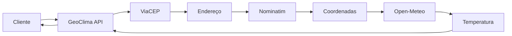

# Arquitetura da GeoClima API

## Objetivo
Este documento descreve a arquitetura da aplicação **GeoClima API**, detalhando os módulos internos, suas responsabilidades e a forma como se conectam às APIs externas.  

---

## Estrutura de Pastas
A API segue a seguinte organização de diretórios:

```text
GeoClimaAPI/
│
├── docs/                       # Documentação do projeto
│   ├── architecture.md         # Detalhes da arquitetura
│   └── GeoClima_Arquitetura.png # Diagrama visual
│
├── postman/                    # Coleções para testes
│   └── GeoClima.postman_collection.json
│
├── src/                        # Código fonte
│   ├── app.py                  # Aplicação Flask e rotas
│   └── services.py             # Serviços de integração
│
├── tests/                      # Testes automatizados
│   ├── __init__.py
│   └── test_app.py             # Testes unitários
│
├── .gitignore                  # Arquivos ignorados pelo Git
├── README.md                   # Este arquivo
└── requirements.txt            # Dependências do projeto
```
---

## Componentes e Responsabilidades

- **app.py**  
  - Implementa a API utilizando Flask.  
  - Define os endpoints:  
    - `/endereco/<cep>`  
    - `/coordenadas/<cep>`  
    - `/temperatura/<cep>`  

- **services.py**  
  - Contém funções responsáveis pela integração com serviços externos:  
    - **ViaCEP** → busca dados de endereço pelo CEP.  
    - **Nominatim (OpenStreetMap)** → converte endereço em latitude/longitude.  
    - **Open-Meteo** → retorna a temperatura atual.  

- **test_app.py**  
  - Implementa testes automatizados com unittest.  
  - Cada endpoint é validado quanto ao status da resposta e ao conteúdo retornado.  

- **postman/GeoClima.postman_collection.json**  
  - Coleção exportada para facilitar testes manuais dos endpoints.  

---

### Fluxo de Funcionamento



1. **Entrada:** Cliente informa um CEP válido
2. **Consulta de Endereço:** API consulta o ViaCEP e obtém o endereço completo
3. **Geocodificação:** Endereço é enviado ao Nominatim para obter latitude e longitude
4. **Dados Climáticos:** Coordenadas são utilizadas no Open-Meteo para obter temperatura atual
5. **Resposta:** Dados consolidados são retornados ao cliente em formato JSON

---

## Diagrama de Arquitetura

O diagrama abaixo ilustra os principais componentes da API e sua interação com os serviços externos:


